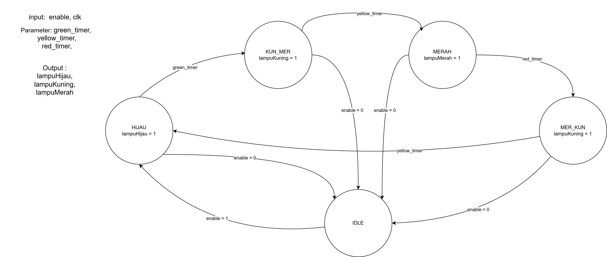
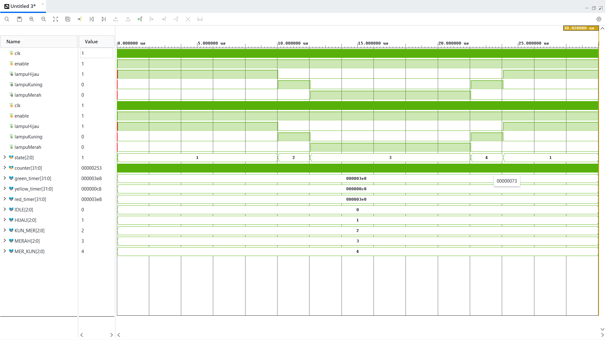

# Traffic Light Controller FSM (Finite State Machine)

Repositori ini mendokumentasikan perancangan sistem kendali lampu lalu lintas berbasis **Finite State Machine (FSM)** yang ditulis menggunakan bahasa deskripsi perangkat keras (HDL) Verilog. Desain ini disimulasikan menggunakan Xilinx Vivado.

Sistem ini dirancang menggunakan arsitektur **Moore Machine** dengan pendekatan 2-blok terstruktur, serta dilengkapi dengan sistem *timer* berbasis penghitung (*counter*) untuk mengatur durasi setiap fase lampu secara presisi.

## Fitur Utama

- **Siklus Lengkap Standar Lalu Lintas**: Menggunakan 4 state utama untuk memastikan transisi yang aman (Hijau $\rightarrow$ Kuning Menuju Merah $\rightarrow$ Merah $\rightarrow$ Kuning Menuju Hijau).
- **Sistem *Timer* Terintegrasi**: Menggunakan *counter* 32-bit untuk mengontrol durasi nyala setiap lampu secara sinkron terhadap sinyal *clock*.
- **Fitur *Enable* (Kontrol Sistem)**: Dilengkapi dengan sinyal kendali untuk menginisialisasi atau mereset sistem ke kondisi awal (*IDLE*) secara aman.
- **Arsitektur Industri (2-Block FSM)**: Pemisahan yang bersih antara logika sekuensial (memori *state* dan *counter*) dan logika kombinasional (dekoder output lampu) untuk menghindari *inferred latch*.

## Diagram FSM

*(Catatan: Letakkan gambar diagram FSM Anda di dalam folder `img/` dengan nama `traffic_light_fsm.png`)*

## Struktur Repositori

- `src/` : Berisi *file* sumber kode utama modul FSM (`traffic_light.v`).
- `tb/`  : Berisi *file testbench* otomatis untuk verifikasi simulasi (`traffic_light_tb.v`).
- `img/` : Berisi dokumentasi visual, termasuk diagram FSM dan tangkapan layar *waveform*.

## Panduan Simulasi

Desain ini dapat disimulasikan menggunakan Xilinx Vivado dengan langkah-langkah berikut:

1. Buat proyek baru di Vivado.
2. Tambahkan `traffic_light.v` sebagai *Design Source*.
3. Tambahkan `traffic_light_tb.v` sebagai *Simulation Source*.
4. Jalankan **Run Simulation** > **Run Behavioral Simulation**.
5. Amati perubahan sinyal pada jendela *Waveform*, termasuk transisi `state`, kenaikan `counter`, dan perpindahan output lampu (`lampuHijau`, `lampuKuning`, `lampuMerah`).

## Hasil Simulasi (Waveform)

